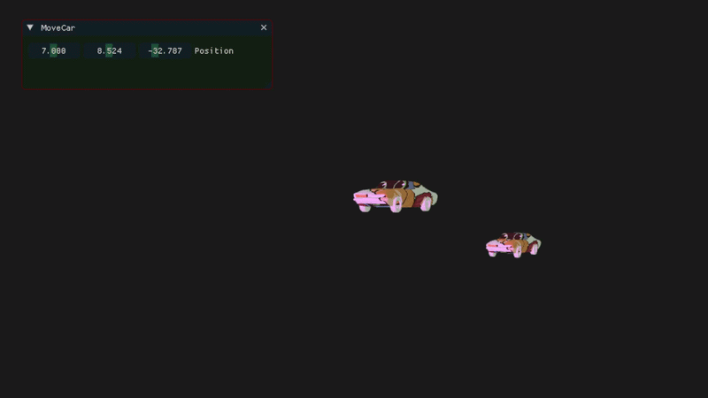
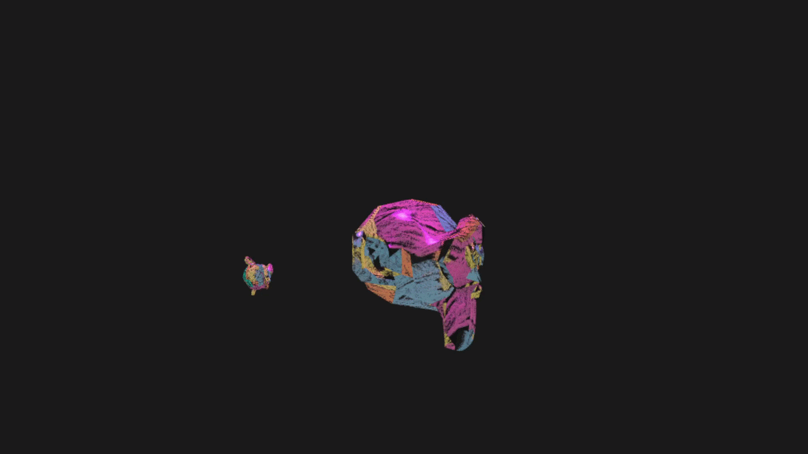
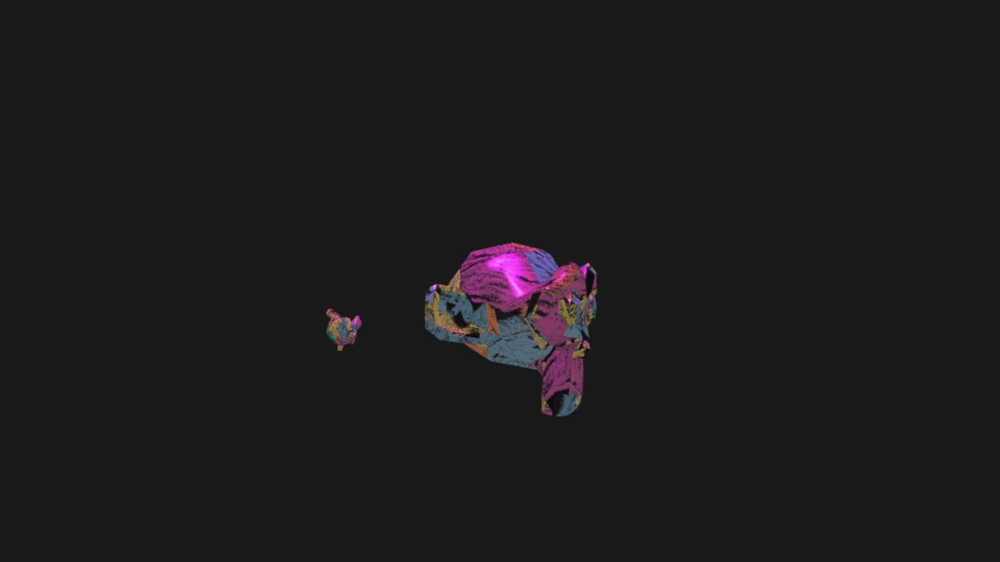
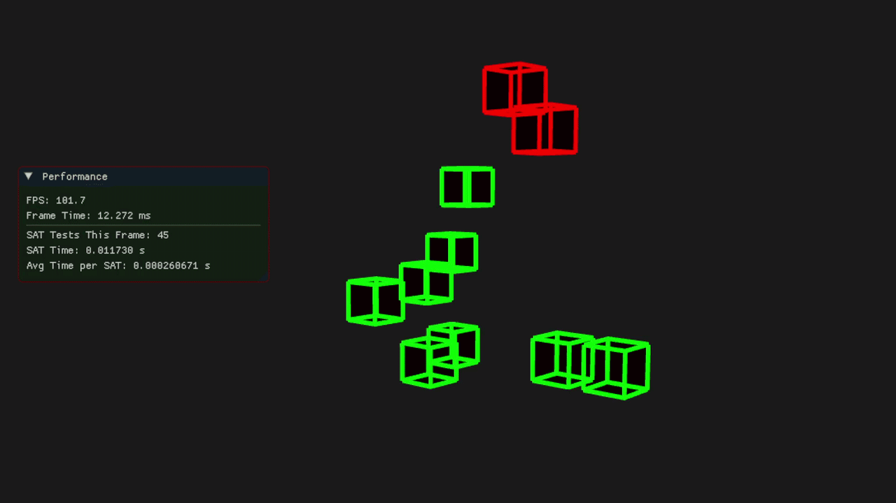
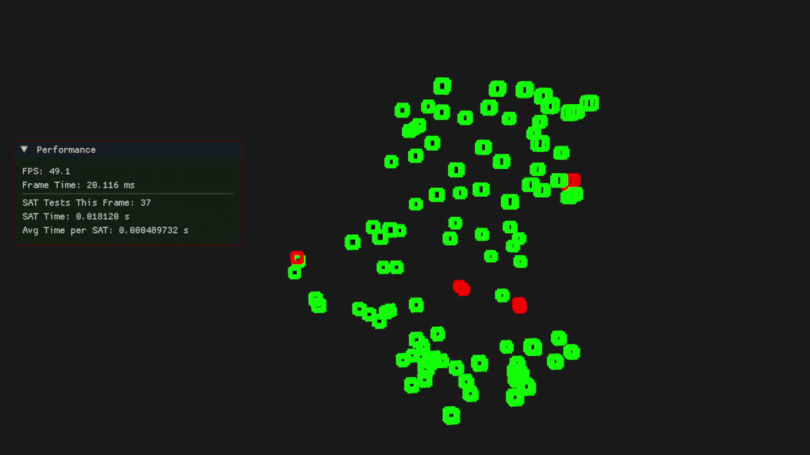
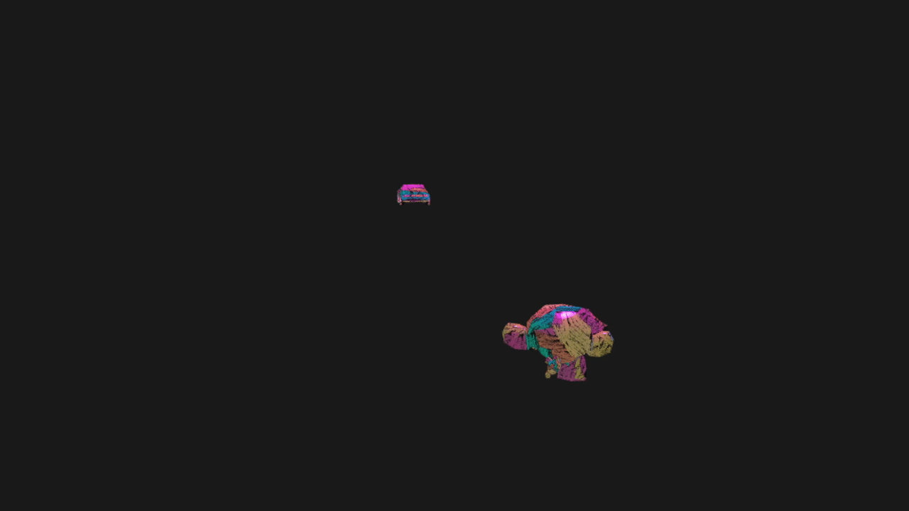
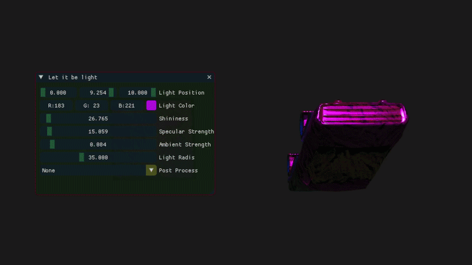
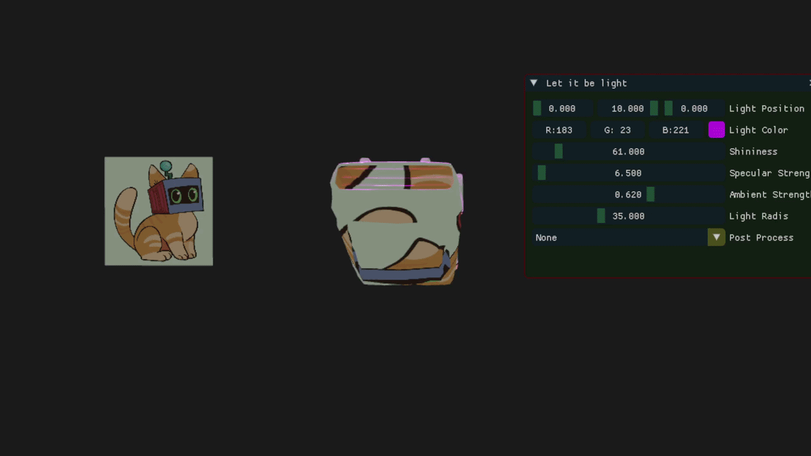

# Game engine made with OpenGL

This project is a custom ***C++/OpenG***L game engine built from scratch, featuring a Unity‑like ***Transform system*** with ***hierarchical GameObjects, parent–child relationships***, and automatic world/local matrix updates. Every object can contain models, colliders, and modular logic through a flexible ***Behavior system*** like in Unity.
The engine includes a full ***Separating Axis Theorem (SAT) collision pipeline*** combined with a high‑performance ***Spatial Hash Grid*** broadphase, enabling efficient collision detection across hundreds of convex objects. A built‑in ***benchmarking framework*** tracks FPS, frame time, SAT test counts, and SAT timings, exporting all results directly to Excel for analysis.

Rendering is handled through a programmable ***OpenGL pipeline*** with custom shaders, an FPS‑style camera, and dynamic ***ADS lighting***. The engine also supports multiple scenes, a developing ***post‑processing*** pipeline (invert, grayscale, edge detection, pixelization), and a customizable ImGui interface for real‑time debugging and visualization.

Together, these systems form a compact but fully functional engine that demonstrates core real‑time concepts rendering, transforms, behaviors, collision detection, scene management, and performance analysis all implemented in modern C++.

## Engine systems overview

| System | Description | Preview |
|-------|-------------|---------|
|**1. GameObject & Transform System**| Core entity system supporting parent–child hierarchies, world/local transforms, and automatic model matrix updates. Every object can contain a model, collider, multiple behaviors and multiple children.| |
|**2. Behavior System**| Component‑like scripts (Translate, Rotate, SinMovement, custom behaviors) that update every frame. Behaviors are modular and attachable to any GameObject. | |
|**3. Rendering Pipeline (OpenGL)**|Shader loading, compilation, linking, uniform management, MVP matrix setup, texture binding, and model rendering. Includes a controllable camera with WASD movement + mouse rotation||
|**4. Convex Collision System (SAT)**|Full Separating Axis Theorem implementation: face normals, edge cross‑products, axis projection, overlap testing. Works with any convex mesh| |
|**5. Spatial Hash Grid**|Hashes objects into 3D grid cells to drastically reduce SAT calls. Only nearby objects are tested. Essential for scaling to thousand of objects.||
|**6. Scene & SceneManager**|Supports multiple scenes, active scene switching, object spawning. ||
|**7. ADS Lighting**|Ambient–Diffuse–Specular lighting system for dynamic scene illumination.||
|**8. Post‑Processing**|Supports invert, grayscale, edge detection and pixelization effects||

## Future improvements
1. To complete my git wiki page (https://github.com/hristodinkov/AdvRendering)
2. Combine my exisitng features with the collision detection
3. Visible hierarchy
4. Scene and Camera view
5. Concave collision detection

## Build instructions

### 1. Install Required Tools
  - Install CLion
  
  - Install CMake (CLion usually includes it)
  
  - Install a C++ compiler:
    - Recommended: MSVC (Visual Studio Build Tools)
    
  - Install vcpkg

### 2. Install dependencies
The engine uses several libraries:
* GLFW (window + input)

* GLM (math)

* ImGui (debug UI)

* xlnt (Excel export)

* GLAD (OpenGL loader, included in the project)

Install the required libraries through vcpkg:
```
vcpkg install glfw3
vcpkg install glm
vcpkg install imgui
vcpkg install xlnt
```
### 3. Open the project in CLion

1. Launch CLion

2. Select Open Project

3. Choose the folder containing the project's CMakeLists.txt

4. CLion will automatically configure the project

### 4. Configure CMake to Use vcpkg
In CLion, go to:

File → Settings → Build, Execution, Deployment → CMake

Add the following to the CMake options:
```
-DCMAKE_TOOLCHAIN_FILE=C:/path/to/vcpkg/scripts/buildsystems/vcpkg.cmake
```
This allows CLion to automatically find GLFW, GLM, ImGui, and xlnt.

### 5. Set the Working Directory
To ensure shaders and assets load correctly:

1. Go to Run → Edit Configurations

2. Select your executable

3. Set Working Directory to the project root

### 6. Build & Run
Click:

* Build → Build Project

* Then press Run
